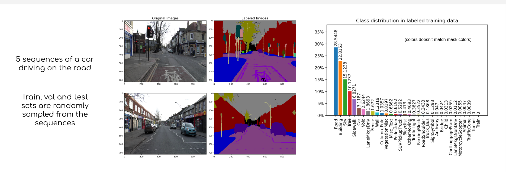
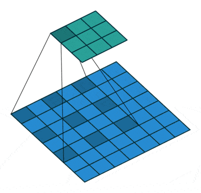
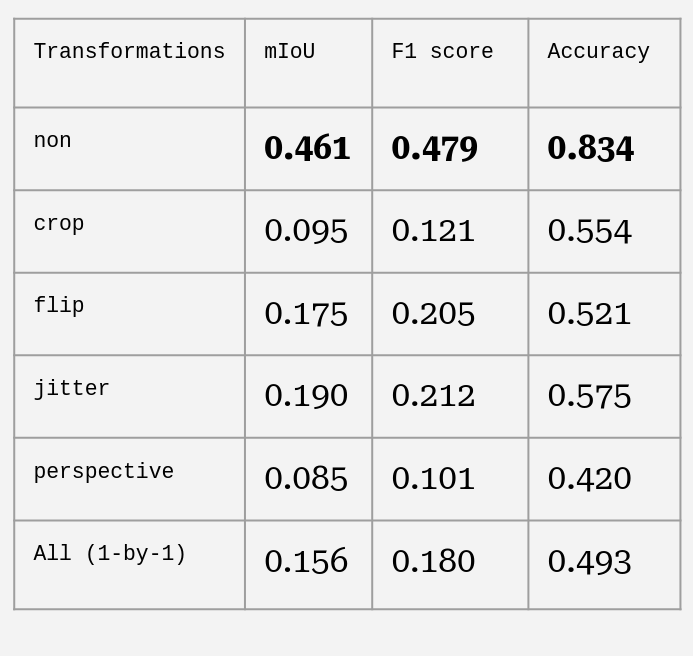
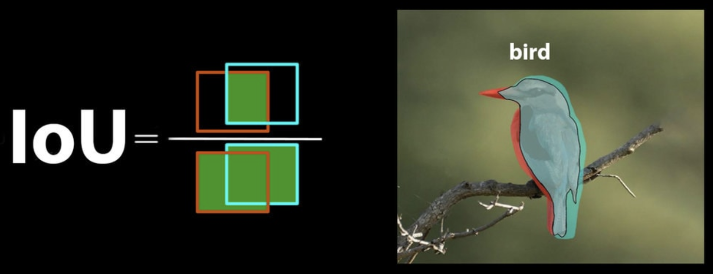

# Image segmentation with deeplabv3 using different data augmentations
- project for advanced machine learning course at ITU
- requires at least python 3.10


### Group members
- Bence Balazs
- Casper Anton Poulsen
- Max De visser


## Data

- Classify each pixel in the image according to our 32 classes

See data characteristics in image below




## Setup Environment
install poetry with `curl -sSL https://install.python-poetry.org | python3 -`
1. Run `poetry install`
2. if the environment is not automatically activating, run `poetry shell`


## Architecture & Training Mechanism
- we used DeeplabV3 as a pretrained model and fitted it to our data. The novelties in this model are the Atrous convolutions and the Atrous Spatial Pyramid Pooling layers. Atrous convolutions gives the kernels a higher receptive field such that we retain more spatial information without increasing the number parameters in the model.
- Since it is a multi-class classification task, we used per pixel Cross entropy as our loss function with ADAM optimiser.



## Training
(Attention: running the training on GPU requires at least 19 Gib of vram)

To perform the training you can either do 

```
python3 src/main.py {augmentations}
```

Available augmentations are:
- none
- flip
- crop
- perspective
- jitter
- all

If you want to train all of the models you can use the shell script "train.sh"

## Results
the trained models can be found via https://drive.google.com/drive/folders/1bBaAwH5eV-CTXY4Fm4XoMjWbdj9K7VkM?usp=sharing

They need to be placed in the "out" folder

Results can be found and generated in "src/Results.ipynb", or here in this table and the predicted masks can be found in the "out/predictions" folder. "src/Results.ipynb" could also be used to generate the prediction masks




## Model Evaluation

We are using the mean Intersection over Union (IoU) metric to evaluate the segmentation ability of our model:


## Discussion
- The data we used was not ideal:
  - train, val, test split are randomly sampled from the 5 sequences, meaning that there are very similar images across the 3 splits. However, if we where to change this, our results would not be comparable with others.
  - The data was noisy:
    - cameras had bad low-light sensors resulting in some of the images being very dark.
    - one sequences had heating-stripes in the window.
    - Consequently, the best model (the model without any augmentations) is most likely overfitting on noise; horrible image compression, lense warp, perspective and static objects in multiple frames.
- Hindsigt reflections:
  - experiment with increasing sharpness and or contrast


## Files
- `out/y_train_class_count.csv` has information of the count of pixels for each class
- `src/dataloader.py` specifies how data is loaded from 